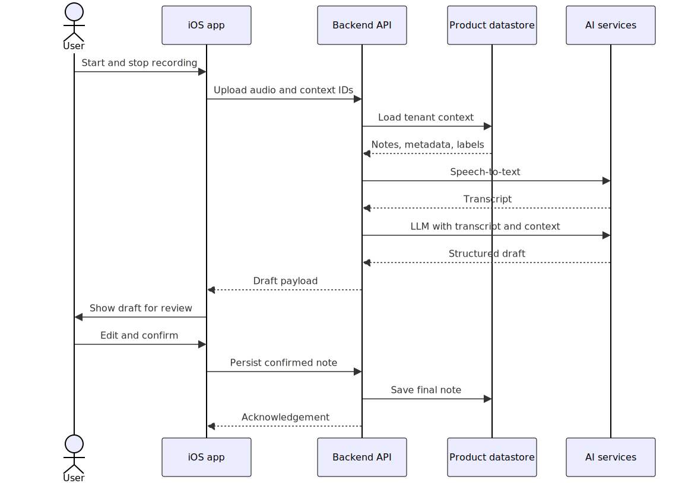
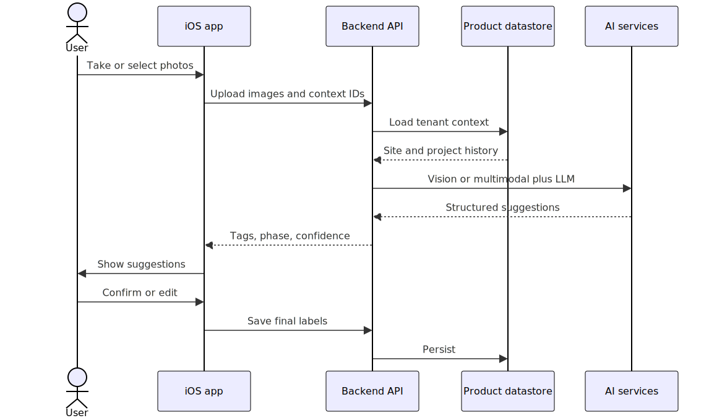

# Native iOS (Swift)

**AI voice notes · Renovation photo intelligence**  
*Architecture, prerequisites, and delivery plan*

**Purpose:** This document is intended for **management and technical leadership** review. It focuses on **how users interact with the iOS app**: **capturing** audio and photos, **reviewing** AI-assisted drafts, and **finalising** what is saved. It also lists **iOS-side prerequisites** and a **phased plan**. It assumes **one iOS developer** (no separate mobile team). **Cloud, AI vendors, and other backend prerequisites** belong in the **backend team’s** companion document.

**Scope of the solution:** Crews get **structured help from what they record and photograph**—for example, a voice note turned into an editable text draft, or site photos with suggested tags (e.g. before/after). **Heavy processing** (speech, vision, language models) is **out of scope for this document** beyond high-level reference; it is owned by **backend services** described elsewhere.

---

## 1. High-level architecture

### 1.1 Guiding principles

- **Processing model (user-facing):** The user **records or photographs** on the device → the app **uploads** with the right job context → the user **waits** (clear status) → the app shows a **draft or suggestions** → the user **edits and confirms** what is stored. **On-device** speech/ML is **not** in v1; richer answers still depend on a **backend** (high level only here).

- **Context and how the product works:** The **product** defines what a job site, project, and before/after **mean** for you. AI **proposes** text and tags; **users confirm** grouping and labels. *(Reference: the backend can use wider customer data so suggestions are not limited to a single upload—details in the backend document.)*

- **Offline / sync:** **Out of scope for the initial release.** A later release may add offline queues and clearer “pending sync” experiences if required.

*Alternative approaches centered on strict on-device processing are **not** in scope for the first iteration; they may be revisited if product or policy requirements change.*

### 1.2 Role of the iOS application

The app’s job is the **user experience** around **capture**, **status**, **review**, and **final save**: record or pick media, attach **project/visit** context, show **progress and errors**, let the user **change** AI output, then **commit** the result. *(Reference: the backend stores the system of record; AI runs server-side.)*

- **Connectivity:** secure uploads; if processing takes time, the user sees **waiting** state and may get **push** or rely on **poll**—product copy should make that obvious. **Background upload** can wait until after early releases if everything stays short and foreground-only.

**Figure — System context (trust boundaries)**  
*The mobile app never holds third-party AI keys; only the backend calls external AI services.*

### 1.3 End-to-end system flow (narrative)

For **voice-only**, **photo-only**, and **picture + voice** jobs, the **same user journey** applies: **capture** → **upload** with project/visit context → **wait** (with clear UI) → **review** draft or suggestions → **save** when satisfied.

- **Reference (backend, high level):** After upload, server-side steps produce the draft the user sees (speech, vision, and language models as needed; unused steps skipped for that job). **Trust boundaries** are summarised in the figure under **§1.2**; implementation belongs with the backend team.

### 1.4 Feature A — Comprehensive AI note from a voice clip

**User flow (initial release)**  
**Record** → **upload** with context → **see a draft** when ready → **edit if needed** → **save** to finalise.

**Figure — Voice note: sequence (typical happy path)**  
*(The diagram includes backend/API steps for reference.)*

**iOS implementation notes**

1. **Capture** — system recording UI; encoding per API contract (e.g. AAC or WAV).
2. **Upload** — include project, visit, user, locale as required; handle failures in the UI.
3. **Review screen** — show draft fields the user can change; **save** sends the confirmed payload.

- **Reference (backend):** Ingestion, speech-to-text, LLM, response shape, versioning, and audit/metadata are specified with the backend team—not expanded here.

*This feature is **audio-only** on the capture side (no on-device vision). The **sequence diagram** shows the full path including server steps.*

**Reference — security:** AI vendor **credentials** stay on the **server**, not in the app binary.

### 1.5 Feature B — Image tagging & inference (renovation / before–after)

**Goals**

- Classify or suggest: **before vs after**, **room/area**, **defects** (optional), **materials visible** (optional).
- Support **multi-photo per site** and **pairing** before/after (user confirm).
- **Picture + voice**: user attaches **photos and a short clip** in one flow; **review** once for a single structured result.

**Recommended pattern: “AI suggests, human confirms”**

1. User **captures or picks** photos, sets **project/visit** (and optional fields like room or before/after intent).
2. App **uploads**; user sees **processing** then **suggested tags / phase** (and similar) on a review screen.
3. User **accepts, edits, or overrides**; app **saves** the final choice.

- **Reference (backend):** Vision/multimodal, optional speech on the clip, tenant context, and heuristics are owned by server design—this document does not specify them.

**Figure — Photo tagging: sequence (typical path)**  
*(Includes backend/API for reference.)*

**Picture + voice (multimodal)**

- **User:** submit **images + one voice clip** in one flow (or linked steps the UI makes feel like one job).
- **Review:** same idea as voice notes—one screen to **adjust and finalise** before save.
- **Reference (backend):** Single server job merges image and transcript; details in backend spec.

*The **sequence diagram** above is a typical **photo-first** path; **picture + voice** adds a clip the user records in the same workflow.*

### 1.6 Security, privacy, and compliance (production expectations)

- **App:** use **TLS** to the API; follow Apple **privacy strings** for mic, camera, and photos; design **sign-in** UX per chosen method (e.g. Sign in with Apple or tokens from your backend).
- **Reference (org / backend):** retention, storage encryption, subprocessors, DPAs, and tenant **authorization** rules are set with the **backend and legal** owners—not detailed here.

---

## 2. Prerequisites (iOS only)

This section lists what **iOS development** needs from **procurement, IT, and finance** while **one person** owns the native client. **Server hosting, databases, AI providers, and backend secrets** are **not** covered here—they should be defined and budgeted in the **backend team’s** submission.

**Apple developer access**

- **Apple Developer Program** (approximately **USD 99 per year**) — required for installing builds on devices, **TestFlight**, and **App Store** submission. The **iOS Simulator** is included with Apple’s development tools and is **not** billed separately.
- **Apple Developer / App Store Connect access** — ability to manage certificates, app identifiers, and releases (the **Account Holder** may be a manager; the developer still needs an appropriate role, e.g. **Admin** or **App Manager**, as decided by the organization).
- **Apple ID** (free) for the developer, added as a member of the company’s **Apple Developer Program** team.

**Hardware and devices**

- **One Mac** that meets **current Xcode requirements** (Xcode runs only on macOS).
- **Physical iPhone(s)** for realistic microphone, camera, and performance testing (simulators alone are not sufficient for sign-off on capture features).

**Engineering hygiene**

- **Source control** (and **CI/CD** if the org uses it) for the iOS codebase, per organizational standards.

**App Store release**

- The same **Developer Program** enables **App Store Connect**; shipping to customers requires **privacy nutrition labels** and other **App Review** requirements for the client app.

**Skills and interfaces**

- The plan assumes **one engineer** comfortable with **Swift, SwiftUI, AVFoundation, and networking**. Delivery also depends on a **stable API contract** and environments from the **backend team** (see their document).

---

## 3. Implementation plan

Phases are **sequential**: **Phase 0** (foundations) → **Phase 1** (voice to AI note) → **Phase 2** (photo intelligence) → **Phase 3** (combined picture and voice) → **Phase 4** (hardening and scale). Timelines in each subsection are **indicative**.

### Phase 0 — Foundations (indicative: 2–4 weeks)

- Application shell on iOS (SwiftUI), project structure, and integration points.
- Authentication approach agreed (Sign in with Apple optional for an early milestone).
- Basic **audio recording and playback**; **camera / photo selection**; screens consuming **server-provided** lists and detail where available.

### Phase 1 — Voice to AI-generated note (core MVP) (indicative: 3–5 weeks)

- **iOS:** record → upload → **review/edit draft** → save; strong **empty/error** states (permissions, network, bad audio).
- **Reference (backend):** ingestion, models, persistence—parallel track per backend plan.
- Agreed **API contract** (shape of draft + errors).

### Phase 2 — Photo intelligence: before/after and related tags (indicative: 3–6 weeks)

- **iOS:** batch or multi-step **photo** UX tied to a **site visit**; **review** suggestions; **save** final labels; optional UI to **link** two photos as before/after.
- **Reference (backend):** vision/multimodal pipeline and response fields—backend document.

### Phase 3 — Combined picture and voice; richer renovation outputs (indicative: 4–8 weeks)

- **iOS:** one guided flow for **photos + voice**; **review** combined result; **push/poll** UX if jobs are slow; **background upload** only if needed later.
- **Reference (backend):** joint processing and extra fields (materials, summaries, etc.).

### Phase 4 — Hardening and scale

- **iOS / client:** resilient uploads, clear retry; App Store **privacy** copy and flows.
- **Reference (backend):** rate limits, idempotency, admin web if any.

**Ongoing in parallel**

- **Product design:** language and flows appropriate to renovation crews; clear states while content is uploading or processing.
- **Legal and procurement:** iOS **App Store** privacy and disclosure obligations; **server-side** vendor and data terms should align with the **backend team’s** documentation.

---

## 4. Summary

- **Experience:** Users **capture** audio and images, **see** AI-assisted drafts or tags, and **finalise** what is saved. **On-device speech recognition** is **not** in v1. **Figures:** **§1.2** — trust boundaries (reference); **§1.4** / **§1.5** — sequences (include backend for context); **§1.3** — user journey in prose.
- **Delivery:** Phases move from **foundations** through **voice-based notes**, **photo intelligence**, **combined media**, and **operational hardening** (see §3). Durations are **indicative** for a **single iOS developer** and subject to scope and dependency on the backend schedule.
- **Apple ecosystem:** **Developer Program** (annual fee) for device distribution and App Store; development **simulator** at no additional charge; microphone and camera **privacy disclosures** in the app as required. **On-device speech APIs** are unnecessary for the approach described here.

- **Backend and AI spend:**
  - Hosting, model vendors, and related **legal and compliance** work for server-side processing are **not covered in this document.**
  - Use the **backend team’s** plan for budgets and vendors.

- **iOS dependencies:** **§2** lists **Apple, Mac, devices, and client release** prerequisites only.

**Suggested distribution:** **Sole iOS engineer** — §1 and §3; **operations / finance / IT** — **§2** (Apple, Mac, devices); **backend leadership** — companion backend document; **product and design** — **§1.2–1.5** (architecture, trust boundaries, narrative flow, feature sequences), and **§3** (phased delivery).
