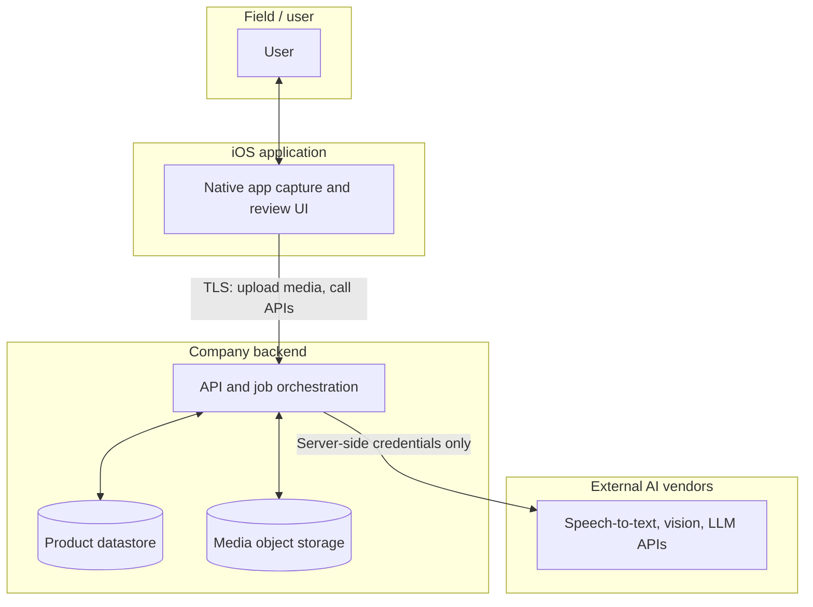
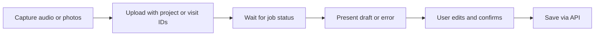
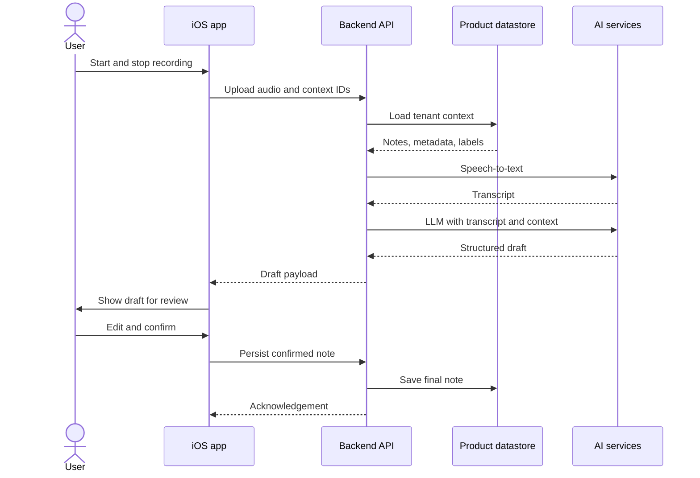
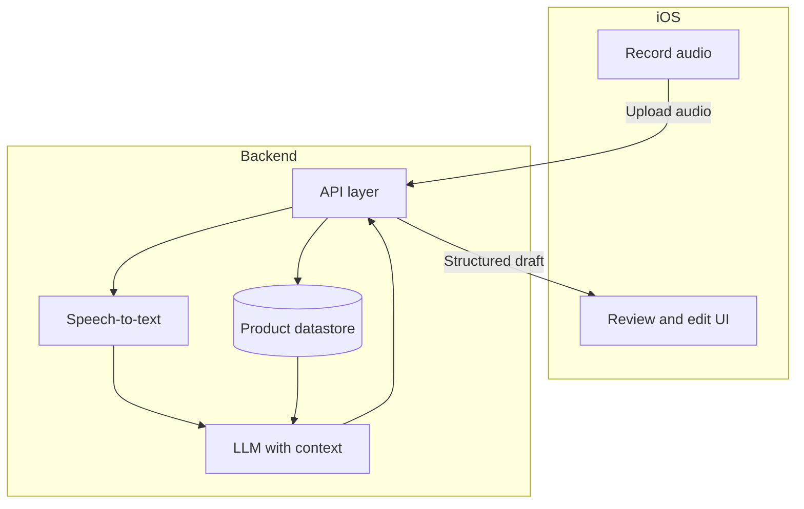
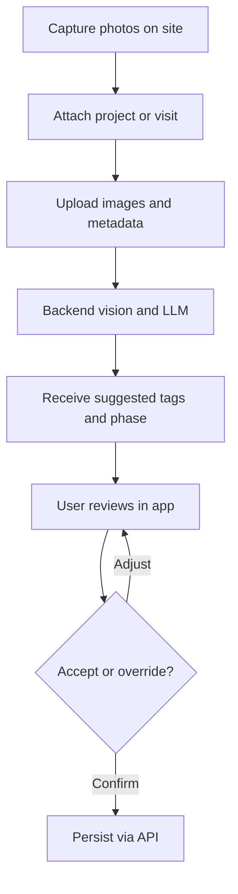
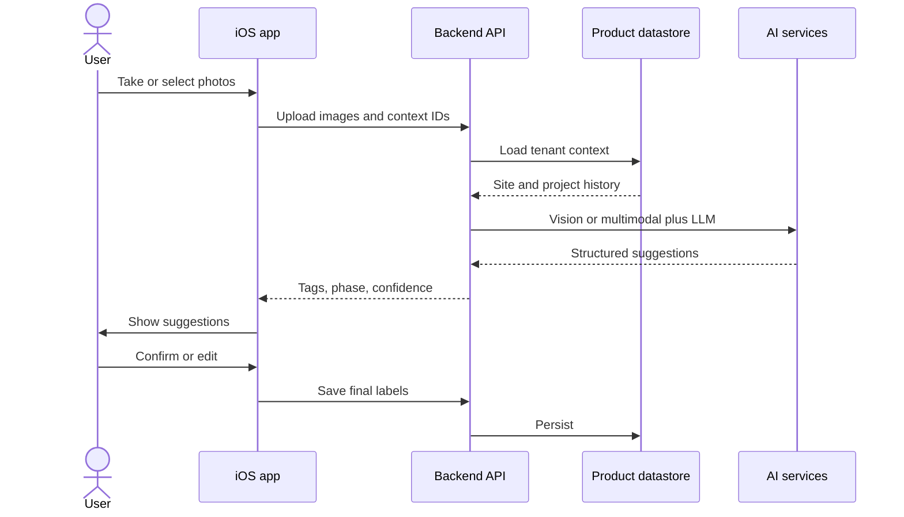
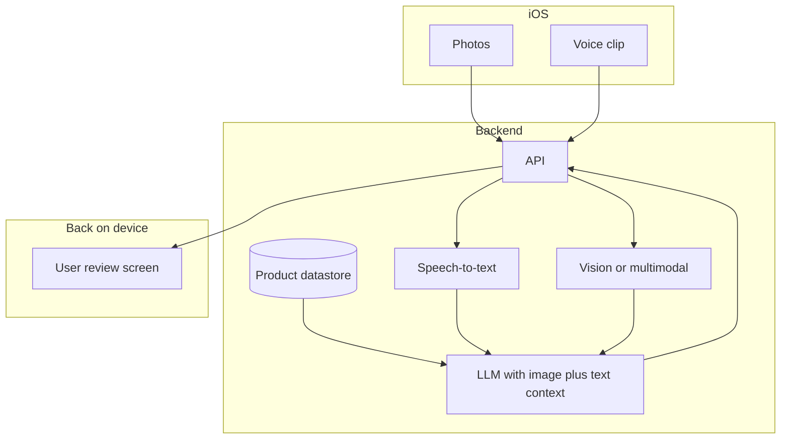

# Native iOS (Swift) — AI Voice Notes & Renovation Photo Intelligence

**Purpose:** This document is intended for **management and technical leadership** review. It summarizes proposed **architecture**, **dependencies** (accounts, platforms, and services), and a **phased implementation** plan for a native iOS product that supports **voice-based notes** and **photo intelligence** in a home-renovation context.

**Scope of the solution:** The first release targets **structured extraction from audio and images**—for example, turning a voice recording into an editable text note, and suggesting or inferring tags (such as before/after) from site photos, optionally combined with voice. The **mobile application** is responsible for capture and presentation; **speech recognition, image understanding, and large-language-model processing** run on **company-controlled backend services**, which can draw on the **broader application dataset** (projects, history, labels, and related media) when generating results.

---

## 1. High-level architecture

### 1.1 Guiding principles

- **Processing model:** **End-to-end flow:** the user records or captures content on the device → media is **uploaded to the backend** → the server performs speech-to-text, image analysis, and LLM steps as needed → a **structured response** is returned to the app for **review and editing**. **On-device** speech and ML are **not planned for v1**, so results can be informed by **organization-wide context** held on the server.

- **Context and how the product works:** The **backend** aggregates each customer’s operational data—projects, sites, notes, photos, labels—so generated output can reflect **more than a single upload**. The **product** still defines business concepts (e.g. job site, project, before vs. after). The system uses AI to **propose** text and tags; **users confirm** final grouping, links, and labels.

- **Offline / sync:** **Out of scope for the initial release.** A later release may add offline queues and clearer “pending sync” experiences if required.

*Alternative approaches centered on strict on-device processing are **not** in scope for the first iteration; they may be revisited if product or policy requirements change.*

**Figure — System context (trust boundaries)**  
*The mobile app never holds third-party AI keys; only the backend calls external AI services.*

### 1.2 Role of the iOS application

The native app does **not** host the core AI workloads. Its responsibilities are: **capture** audio and images, **upload** them with the correct project and visit identifiers, **communicate with the API** for job status and results, **present** drafts and errors clearly, and allow the user to **edit and confirm** outcomes before persisting them via the server. The **backend** remains the **system of record** for notes, labels, and stored media.

- **Connectivity:** standard secure uploads (e.g. multipart or signed URLs); for longer-running jobs, the client may **poll** or receive **push** notifications when processing completes. **Background upload** may be deferred to a later phase if early releases remain foreground-oriented.

**Figure — Responsibilities on the device (logical flow)**  
*Processing and storage of record data remain on the server; the app orchestrates the user experience.*

### 1.3 Feature A — Comprehensive AI note from a voice clip

**User flow (initial release)**  
Record → **upload audio and identifiers** to the backend → server runs **speech-to-text and LLM** steps using **tenant-wide data** → the app receives a **structured draft** → the user **reviews, edits, and saves**.

**Figure — Voice note: sequence (typical happy path)**  
*Solid arrows are requests or forward progress; dashed arrows are responses or reads.*

**Processing (server-side after upload)**

1. **Capture (device)** — standard iOS audio APIs; encoding as agreed with the API (e.g. AAC or WAV).
2. **Upload** — secure transfer (multipart upload or signed URL pattern), including project, visit, user, and locale where applicable.
3. **Backend** — speech-to-text, then LLM with **context retrieved** from the product datastore (e.g. recent notes, metadata, label vocabulary).
4. **Response** — a versioned **structured payload** (e.g. title, summary, bullet points, action items, optional confidence scores, optional transcript for display).
5. **Review (device)** — present the draft for editing; **persist** confirmed content through the API.
6. **Audit (backend)** — retain sufficient metadata (e.g. model version, job identifier) for operations and compliance, per policy.

**Figure — Voice note: internal components (backend pipeline)**  
*How work is split after an upload reaches the API.*

**Production practice:** third-party AI services should be invoked from the **backend**, not from the mobile binary—so **credentials, usage limits, and access to organizational data** remain under company control.

### 1.4 Feature B — Image tagging & inference (renovation / before–after)

**Goals**

- Classify or suggest: **before vs after**, **room/area**, **defects** (optional), **materials visible** (optional).
- Support **multi-photo per site** and **pairing** before/after (user confirm).
- **Picture + voice**: one asset group — photo(s) + short voice; STT + vision **fused** in the LLM with a single structured result.

**Inputs the system can combine (primarily on the server)**

- **Visual:** **Backend** vision / **multimodal** model over uploaded images (and any stored thumbnails).

- **Metadata:** The client sends **date/time**, optional **GPS**, and **sequence** within a visit; the server joins **project and site history** from the product datastore.

- **User:** Selections such as before/after, **project**, and optional **room**—captured as fields on upload or in follow-up steps.

- **Audio:** A voice note attached to a photo batch → **server speech-to-text** → combined with image understanding in one LLM pass.

- **Heuristics:** Server-side rules (e.g. ordering within a visit) used as **soft priors**—still **suggestions** until the user confirms.

**Recommended pattern: “AI suggests, human confirms”**

1. The app **uploads** images and context identifiers to the API.
2. The backend runs **vision / multimodal and LLM** steps with the **same tenant-wide context** used for voice, returning a **structured result** (e.g. suggested phase, confidence, room estimate, labels).
3. The app **presents suggestions**; the user **accepts or corrects** them; outcomes are **stored via the API** for operational use and future quality improvements.

**Figure — Photo tagging: user journey**

**Figure — Photo tagging: sequence (typical path)**

**Picture + voice (multimodal)**

- Upload: **image(s) + audio** in one job (or linked job ids); **all transcription on the server**.
- Backend: single pipeline that uses **image data, transcript, and organizational context** to produce tags, phase, captions, and related fields.
- Same **review** pattern as text notes.

**Figure — Multimodal job: picture plus voice (server-side merge)**

*The API returns a single structured result after **STT** and **vision** outputs are merged with **datastore context** in the LLM step.*

### 1.5 Security, privacy, and compliance (production expectations)

- **Transport security** (TLS) for all API traffic; additional hardening (e.g. certificate pinning) if required by security policy.
- **Encryption at rest** for object storage and application databases holding uploads and derived content.
- **Personally identifiable information** may appear in site imagery and audio; align on **retention**, **subprocessors**, and **customer agreements** (including use of external AI providers).
- **Authentication and authorization** (e.g. Sign in with Apple, enterprise identity, or tokens) so access to tenant data is **scoped per user and organization**.

---

## 2. Prerequisites (summary)

The items below are the **main dependencies** to clarify with **procurement, IT, and finance** before engineering commits to an integrated build. Vendor choices and detailed runbooks can be finalized during execution.

**Accounts and platforms to establish**

- **Apple Developer Program** (approximately **USD 99 per year**) — required for team distribution to devices, **TestFlight**, and **App Store** submission. The **iOS Simulator** is included with Apple’s development tools and is **not** billed separately.
- **Cloud or managed backend** (e.g. AWS, Google Cloud, Microsoft Azure, or an application platform) with **billing enabled** — hosts APIs, object storage, and background processing.
- **AI service providers** for **server-side** speech-to-text and language / multimodal models (often consolidated with one vendor; typically **usage-based** pricing). **Credentials must reside on the server**, not in the client application.
- **Administrative access** for the engineering lead or platform team to the Apple, cloud, and AI consoles (or an approved secrets-management process).
- **macOS hardware** for iOS developers, as Xcode runs only on Mac.

**Additional planning**

- **Physical iOS devices** for validation of microphone, camera, and real-world performance (simulators are insufficient on their own).
- **Source control and CI/CD** per organizational standards; if enterprise login is required beyond Sign in with Apple, budget for the chosen **identity** product.

**App Store release**

- The same **Developer Program** enables **App Store Connect**; public release will require **privacy disclosures** and standard **App Review** compliance.

**Capabilities**

- Delivery assumes **iOS engineering** plus **backend** capability to integrate cloud infrastructure and external AI APIs securely.

---

## 3. Implementation plan

**Figure — Delivery phases (indicative order and dependency)**  
*Each phase builds on the previous one; timelines are estimates.*

### Phase 0 — Foundations (indicative: 2–4 weeks)

- Application shell on iOS (SwiftUI), project structure, and integration points.
- Authentication approach agreed (Sign in with Apple optional for an early milestone).
- Basic **audio recording and playback**; **camera / photo selection**; screens consuming **server-provided** lists and detail where available.

### Phase 1 — Voice to AI-generated note (core MVP) (indicative: 3–5 weeks)

- **Backend:** audio ingestion, speech-to-text, LLM pipeline, draft persistence; initial **context** from the product database (e.g. recent notes and project metadata, expanding over time).
- **iOS:** record → upload → await result → **review and edit** → save through the API.
- Formal **API contract** (versioned responses and error handling).
- User-visible handling of permissions, network failures, and low-quality or empty transcriptions.

### Phase 2 — Photo intelligence: before/after and related tags (indicative: 3–6 weeks)

- Batch photo workflows tied to a **site visit**; upload to backend; same **context-aware** approach as voice.
- Backend **vision / multimodal** processing and structured outputs, reusing the Phase 1 context layer.
- User review of suggestions, overrides, and persistence via API.
- Optional: linking two photos explicitly as before/after pairs.

### Phase 3 — Combined picture and voice; richer renovation outputs (indicative: 4–8 weeks)

- Unified processing for **images plus audio**; backend **speech, vision, and LLM** with shared organizational context.
- Expanded structured fields (e.g. materials, defects, client-ready summaries) as product requirements define.
- **Push notifications or polling** for long-running jobs; **background upload** if usage patterns require it.

### Phase 4 — Hardening and scale

- Rate limiting, reliable retries, and idempotent uploads.
- Optional **administrative web experience** for B2B customers, if in scope.
- App Store **privacy** artifacts and **data lifecycle** (e.g. deletion) aligned with policy.

**Ongoing in parallel**

- **Product design:** language and flows appropriate to renovation crews; clear states while content is uploading or processing.
- **Legal and procurement:** vendor agreements and customer-facing data terms, especially where external AI services process customer media.

---

## 4. Summary

- **Architecture:** A native **SwiftUI** client **captures and uploads** content; **backend services** perform **speech-to-text, image understanding, and LLM** steps using **per-tenant organizational data**; users **review and confirm** results. **Version 1 does not rely on on-device speech recognition.**
- **Delivery:** Phases move from **foundations** through **voice-based notes**, **photo intelligence**, **combined media**, and **operational hardening** (see §3). Durations are **indicative** and subject to resourcing and scope decisions.
- **Apple ecosystem:** **Developer Program** (annual fee) for device distribution and App Store; development **simulator** at no additional charge; microphone and camera **privacy disclosures** in the app as required. **On-device speech APIs** are unnecessary for the approach described here.
- **External services:** Cloud hosting, object storage, and **server-side** AI vendors; budget should include **usage-based** API costs and **legal / compliance** review where customer data is processed by third parties.
- **Dependencies:** Section **§2** lists the principal **accounts, access, and hardware** decisions to align on with stakeholders before full integration work.

**Suggested distribution:** **Engineering** — §1 and §3; **operations / finance / IT** — §2; **product and design** — user journeys and **flow figures** in §1.3–1.4.

**Figures in this document:** §1.1 system context; §1.2 client responsibility flow; §1.3 voice sequence and backend components; §1.4 photo journey, photo sequence, and multimodal pipeline; §3 phased delivery.
